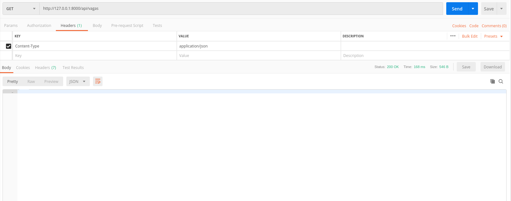

# apiVagas

This is a simple API, that is, we do not use ALL the concepts called "default" by most developers.

This API was originally "developed on: 11/11/2018 and
the repository was restructured on 04/01/2019

API created in "environment" Linux: Ubuntu

Python: 3.6.7  / 

Django: 1.11.7  / 

Django REST Framework: 3.7.3

# Road Map:

Create and activate VENV

pip install -r requirements.txt

python manage.py makemigrations

python manage.py migrate

python manage.py createsuperuser

python manage.py runserver

# Available Endpoints: (considering that the API is running locally)

GET: (paging of 2 records was used for example only)

(sending ....)

(receiving ...)

GET by ID:

(receiving ...)

 ADD NEW VAGA:

(sending ....)

(sending ....)

(receiving ...)

UPDATE Vaga by ID:

(sending ....)

(sending ....)

(receiving ....)

